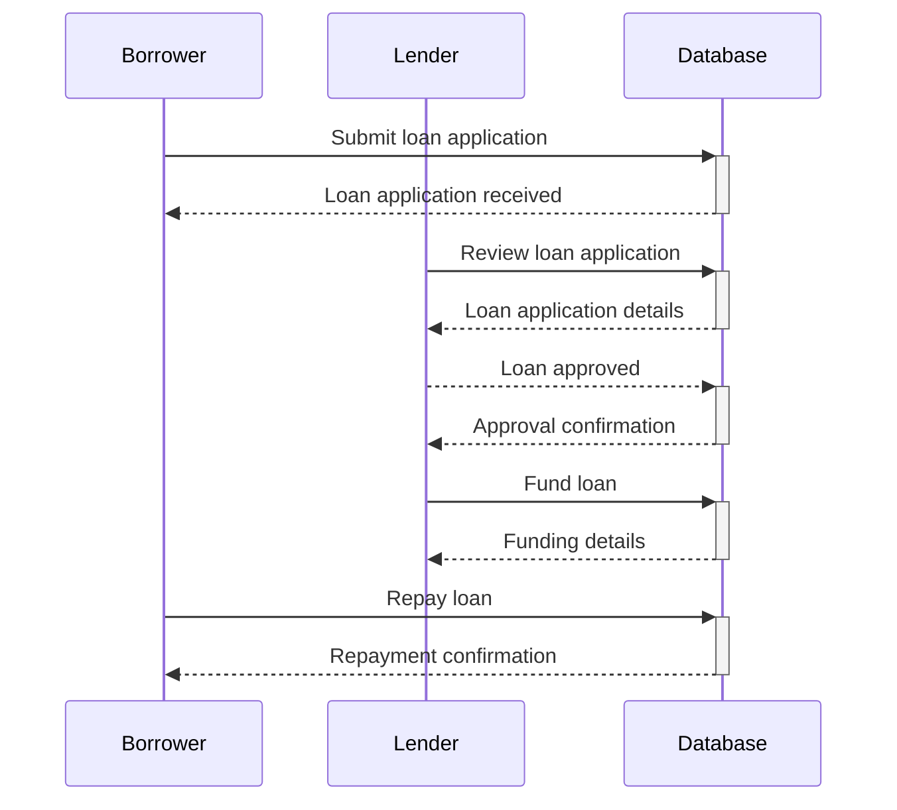
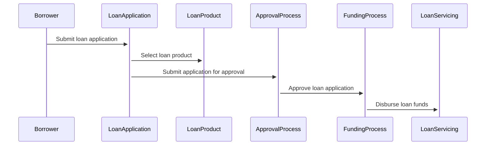

This code creates a sequence diagram using the `sequenceDiagram` directive. The diagram shows the sequence of events that occur when a borrower submits a loan application, and how the application is processed and approved by the lender.

In this example, the `Borrower` and `Lender` are represented as participants in the transaction, and the `Database` represents the loan origination data model. The arrows between the participants and the database represent messages that are exchanged during the transaction.

The sequence diagram shows that the borrower submits a loan application to the database by sending a message "Submit loan application." The database receives the message and sends a confirmation message "Loan application received" back to the borrower.

The lender then reviews the loan application by sending a message "Review loan application" to the database. The database sends the loan application details to the lender, who then approves the loan by sending a message "Loan approved" to the database. The database sends a confirmation message "Approval confirmation" back to the lender.

The lender then funds the loan by sending a message "Fund loan" to the database. The database sends the funding details to the lender. Finally, the borrower repays the loan by sending a message "Repay loan" to the database, and the database sends a repayment confirmation message back to the borrower.

