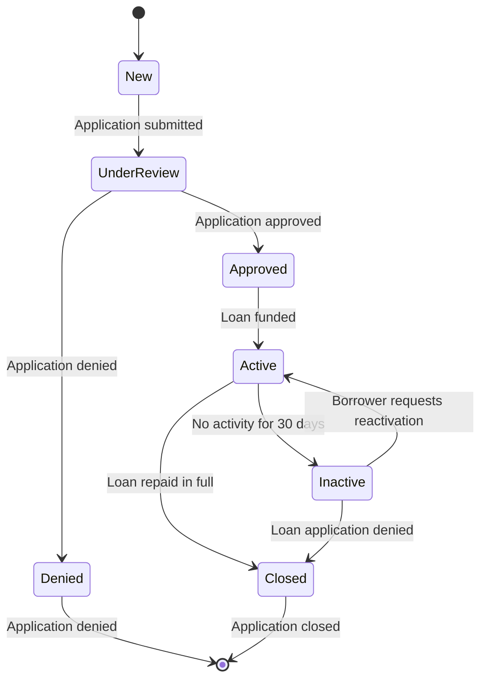

This code creates a state diagram using the `stateDiagram-v2` directive. The diagram shows the different states an application can have and the transitions between them.

In this example, the initial state is represented by `[*]`, which means the application is in an undefined state. From the initial state, the application can transition to the `New` state when the borrower submits the loan application.

Once the application is submitted, it transitions to the `UnderReview` state. The application remains in the `UnderReview` state until the lender reviews it and either approves or denies it. If the application is approved, it transitions to the `Approved` state. Alternatively, if the application is denied, it transitions to the `Denied` state.

If the application is in the `Approved` state, the loan is funded, and the application transitions to the `Active` state. The application remains in the `Active` state until either it is repaid in full and transitions to the `Closed` state, or if there is no activity on the application for 30 days, it transitions to the `Inactive` state.

If the application is in the `Inactive` state, it can be reactivated by the borrower, which transitions it back to the `Active` state. Alternatively, if the loan application is denied, it transitions to the `Closed` state.

Finally, from the `Denied` state or any other state, the application can transition back to the initial state when it is closed or denied.
