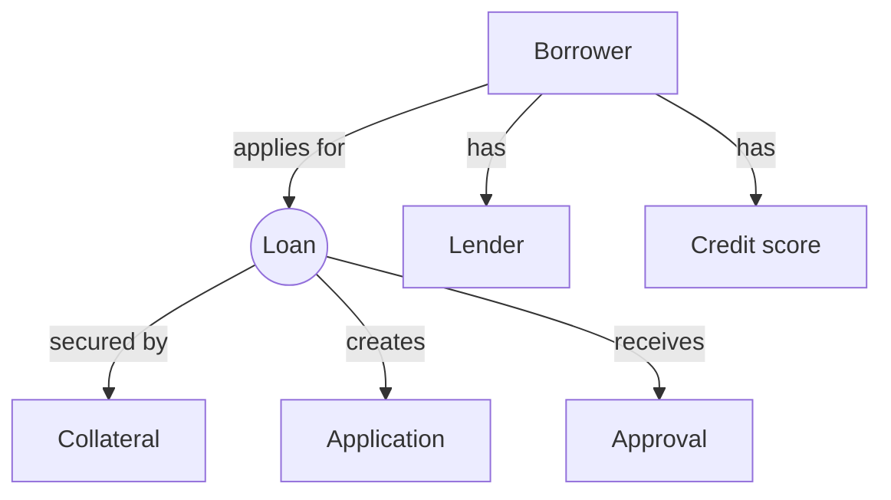

This code uses the `graph TD` directive to create a directed graph with top-to-bottom flow. Each entity in the loan origination data model is represented by a node in the graph, and the relationships between the nodes are represented by arrows.

In this example, the `Borrower` node is connected to the `Loan` node by an arrow labeled "applies for," indicating that the borrower applies for the loan. The `Borrower` node is also connected to the `Lender` node by an arrow labeled "has," indicating that the borrower has a relationship with the lender.

The `Loan` node is connected to the `Collateral` node by an arrow labeled "secured by," indicating that the loan is secured by collateral. The `Borrower` node is connected to the `Credit score` node by an arrow labeled "has," indicating that the borrower has a credit score.

Finally, the `Loan` node is connected to the `Application` node by an arrow labeled "creates," indicating that the loan creates an application, and to the `Approval` node by an arrow labeled "receives," indicating that the loan receives an approval.

Note that you will need to have the Mermaid library installed and properly configured in your environment in order to use this code to generate a diagram.

graph LR
A[Borrower] -->|applies for| B(Loan Application)
B -->|is for| C[Loan Product]
B -->|is approved through| D[Approval Process]
D -->|leads to funding| E[Funding Process]
E -->|is serviced by| F[Loan Servicing]
